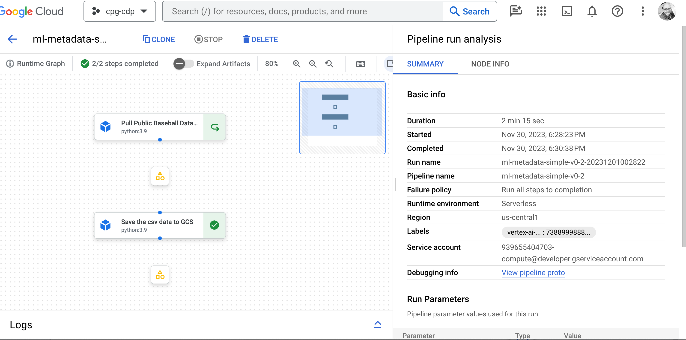
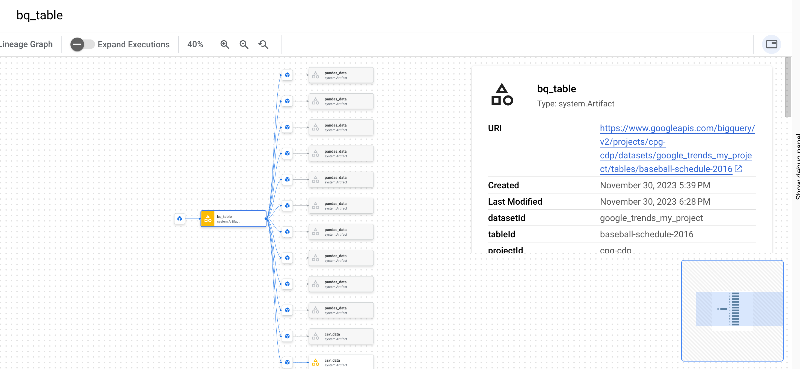

# ML METADATA - Vertex Pipelines with Google Cloud Types
Using Google cloud types along with artifacts allow users to store metadata automatically as they are created.



## Overview
In [pipelines-with-metadata](pipelines-with-metadata.ipynb), users will create two custom components
- The first component will create a [BQTable](https://google-cloud-pipeline-components.readthedocs.io/en/google-cloud-pipeline-components-2.0.0/api/artifact_types.html#google_cloud_pipeline_components.types.artifact_types.BQTable) artifact subclass
- The second component will read the data and store a csv extract to gcs in the form of a custom [artifact](https://www.kubeflow.org/docs/components/pipelines/v2/data-types/artifacts/)


#### Example Usage

```python
@component(
        base_image='python:3.9',
        packages_to_install=[
            'google.cloud.bigquery'
            ,'google.cloud.storage'
            ,'pandas'
            ,'google_cloud_pipeline_components'
            ,'db-dtypes'
            ],
)
def save_schedule_to_gcs(
    bq_table: Input[BQTable],
    project_id: str,
    bucket_name: str,
    destination_blob_name: str,
    region: str = 'us-central1'
) -> NamedTuple('outputs'
, pandas_data=Artifact)
...
return (pandas_data, )
```

To get an understanding of how the pipeline components connect, the DAG is developed using `outputs` and `inputs`:

```python
    pull_baseball_data_op = pull_baseball_data(
        year = year,
        project_id = project_id,
        dataset_id = dataset_id,
        output_table_name = output_table_name
    ).set_display_name("Pull Public Baseball Data Schedules")

    save_schedule_pandas_gcs_op = save_schedule_to_gcs(
        bq_table = pull_baseball_data_op.outputs['bq_table'],
        project_id = project_id,
        bucket_name = bucket_name,
        destination_blob_name = destination_blob_name
    ).set_display_name("Save the csv data to GCS")
```

`pull_baseball_data_op.outputs['bq_table']` is an example of pulling the output artifact from the component.

#### Accessing data lineage

Be sure to select an artifact and click on `view lineage`:



#### Using pipeline components

Official guide [here](https://cloud.google.com/vertex-ai/docs/pipelines/use-components#consume_or_produce_artifacts_in_your_component)
Notebook [here](./Intro to Vertex Pipelines.ipynb)
_______________
#### Other Guides
https://cloud.google.com/vertex-ai/docs/pipelines/use-components#consume_or_produce_artifacts_in_your_component